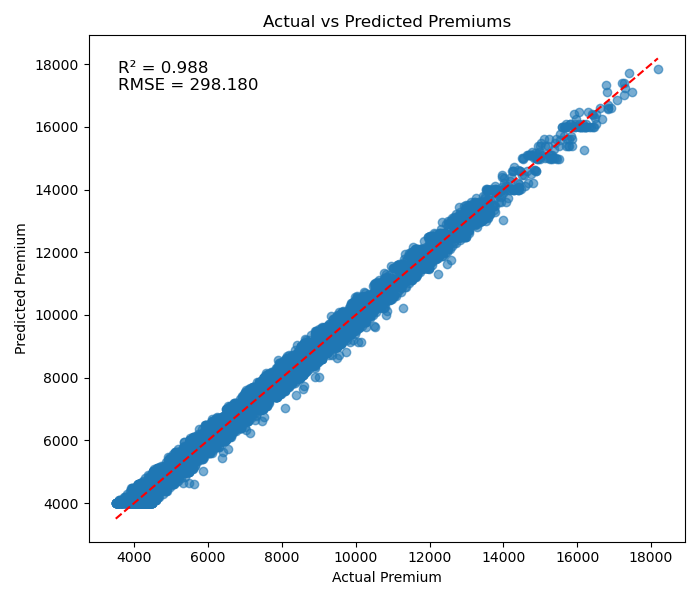
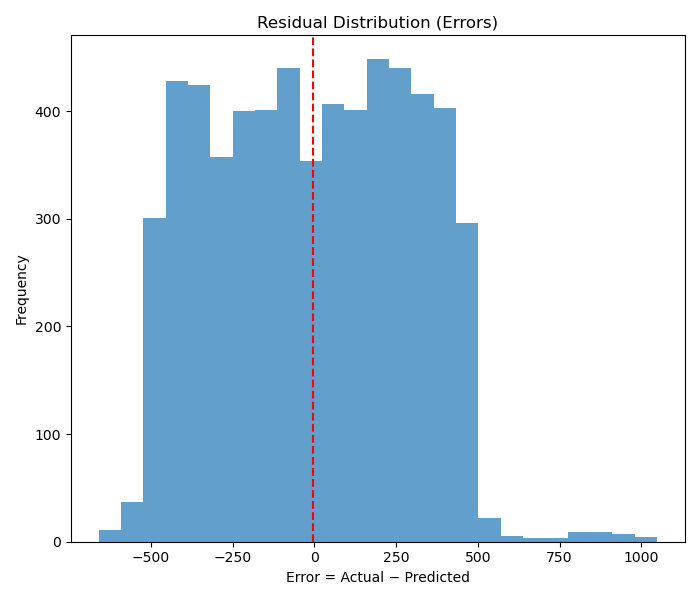
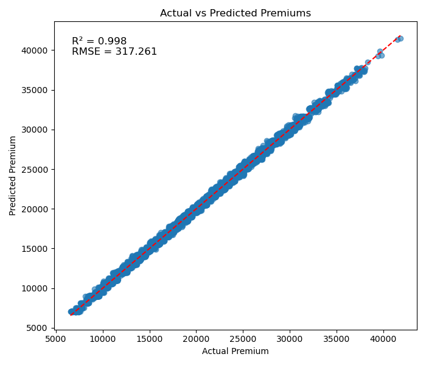
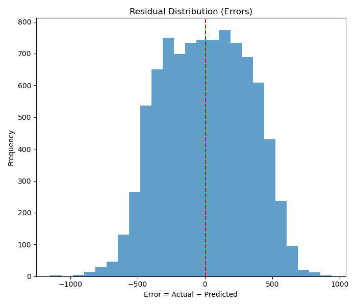
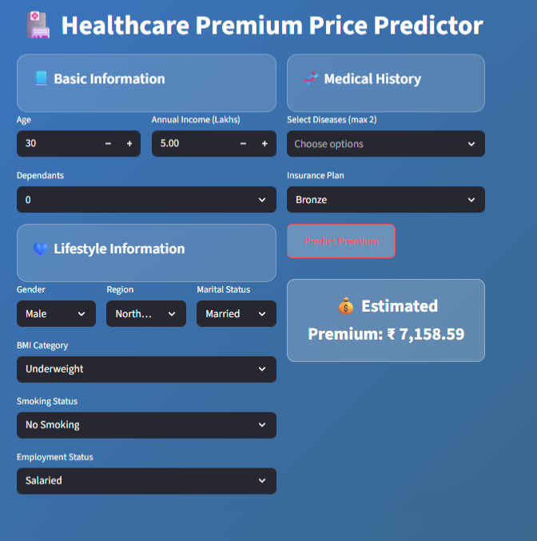

# 🏥 Healthcare Premium Price Prediction  

 

---

## 📌 Table of Contents  
- [Project Overview](#-project-overview)  
- [Problem Statement](#-problem-statement)  
- [Dataset](#-dataset)  
- [Features](#-features)  
- [Project Workflow](#-project-workflow)  
- [Model Export](#-model-export-)  
- [Project Deliverables](#-project-deliverables)  
- [Key Learnings](#-key-learnings)  
- [Results](#-results)  
- [Tools & Technologies Used](#-tools--technologies-used)  
- [Skills Demonstrated](#-skills-demonstrated)  
- [Connect with Me](#-connect-with-me)  

---

## 🚀 Project Overview  

This project predicts **health insurance premium prices** using customer demographics, lifestyle habits, and medical risk indicators.

During model development, an insight from **Error Analysis** showed:
> Premium pricing behavior significantly differs by Age Group.

So, a **dual-model strategy** was implemented:
- Model for Age **≤ 25** (Young Group)
- Model for Age **> 25** (Adult Group)

Multicollinearity was reduced using **Variance Inflation Factor (VIF)** for a more stable and interpretable ML solution.

---

## ❗ Problem Statement  

**Shield Insurance Company** faced challenges in accurate pricing of healthcare premiums due to:
- Diverse age and lifestyle groups
- Different medical & genetic risk profiles
- High variance in health-related costs

🎯 **Goal:**  
Develop a Machine Learning model that **predicts premium amounts** based on:
- Demographic features  
- Lifestyle factors  
- Health risk indicators  
- Insurance plan type  

✨ Expected Outcome:
- Fair & risk-based pricing  
- Better underwriting decisions  
- Reduced claim loss ratios  
- Improved customer satisfaction  

---

## 📂 Dataset  

Includes critical real-world insurance variables:
- Age, BMI, genetic risk
- Region, gender, marital status
- Employment & smoking behavior
- Medical history
- Insurance plan category

🎯 **Target Variable:**  
`premium_amount`

---

## 🔑 Features  

| Category | Features |
|---------|----------|
| Demographics | age, gender, region, marital_status |
| Lifestyle | smoking_status, employment_status |
| Health Risk | bmi, normalized_risk_score, genetical_risk |
| Policy Factors | insurance_plan, income_level, medical_history |

---

## 🛠 Project Workflow  

### 🔍 1️⃣ Exploratory Data Analysis (EDA)
- Outlier detection
- Risk vs Premium relationships
- Correlation patterns

### 🧹 2️⃣ Data Preprocessing
- Handled missing & inconsistent data
- Encoding:
  - Label Encoding → insurance_plan
  - One-Hot Encoding → other categoricals

### ⚙️ 3️⃣ Feature Engineering
- Added **genetical_risk**
- Used **normalized_risk_score**
- **VIF** to remove multicollinearity

### 🔀 4️⃣ Model Strategy (Age-based Segmentation)
- Group A: Age ≤ 25
- Group B: Age > 25

### 🧪 5️⃣ Model Training + Scaling
- **StandardScaler** for each group
- Models:
  - Gradient Boosting Regressor → Young Group
  - XGBoost Regressor → Adult Group

### 📊 6️⃣ Evaluation
- R² Score  
- RMSE  
- Better performance after segmentation

---

## 💾 Model Export 🚀

Final saved files:

model_young_gr.joblib
xgb_model_old_gr.joblib
scaler_young_gr.joblib
scaler_old_gr.joblib

---

## 📦 Project Deliverables  

This repository includes:
- Jupyter Notebooks (EDA, Error Analysis, Young & Adult Models)
- Final ML models and scalers (`.joblib`)
- Streamlit App for premium prediction
- README documentation 📘

---

## 🎯 Key Learnings  
- **Segmented modeling** improves prediction logic  
- **VIF** enhances model robustness  
- Feature impact matters more than model complexity  
- Practical insurance underwriting insights  

---

## 📈 Results  

| Model | Age Group | Best Metrics | Comments |
|-------|----------|--------------|----------|
| Gradient Boosting | ≤ 25 years | High R² • Low RMSE | Best fit for low-variance young cases |
| XGBoost | > 25 years | Higher R² • Lower RMSE | Handles risk complexity better |

📌 Performance increased significantly after **age-based modeling**

## 📈 Results  

### 🔹 Model Performance Visualizations

<table>
  <tr>
    <td align="center">
      
       <b>Actual vs Predicted (Young Group)</b>
       Excellent alignment → stable predictions for low-variance customers.
    </td>
    <td align="center">
      
       <b>Error Distribution (Young Group)</b>
       Errors mostly centered around zero → reliable model behavior.
    </td>
    <td align="center">
      
       <b>Actual vs Predicted (Adult Group)</b>
       XGBoost handles complex risk patterns effectively in adults.
    </td>
  </tr>
  <tr>
    <td align="center">
      
       <b>Error Distribution (Adult Group)</b>
       Good distribution → lower variance after age-based modeling.
    </td>
    <td align="center">
      
       <b>Streamlit App UI</b>
       Simple and user-friendly interface for premium prediction.
    </td>
    <td align="center">
      <b>🚀 Final Outcome</b>  
      ✔ Higher accuracy after model segmentation 
      ✔ Better risk estimation for business decisions 
      ✔ Fully deployable ML solution for Insurance Domain
    </td>
  </tr>
</table>

---

## 🛠 Tools & Technologies Used  

- **Python**  
- **Pandas, NumPy**  
- **Matplotlib, Seaborn**  
- **Scikit-learn**  
- **Linear Regression**   
- **XGBoost**  
- **Streamlit**  
- **Joblib**  

---

## 🧑‍💻 Skills Demonstrated  

- Machine Learning Deployment  
- Feature Engineering & Selection  
- Multicollinearity Handling (VIF)  
- Model Evaluation & Error Analysis  
- Business-Driven ML Strategy  
- Insurance Analytics  

---

## 🤝 Connect with Me  

📌 GitHub: https://github.com/noumanjamadar  
💼 LinkedIn: https://www.linkedin.com/in/mohammad-navaman-jamadar/  
🌐 Portfolio: https://codebasics.io/portfolio/Mohammad-Navaman-Jamadar

---
